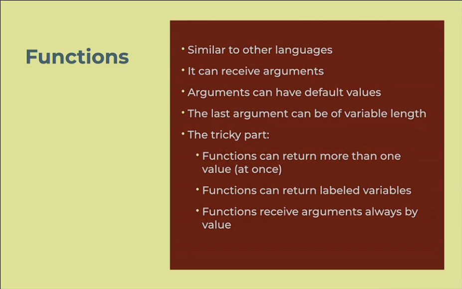
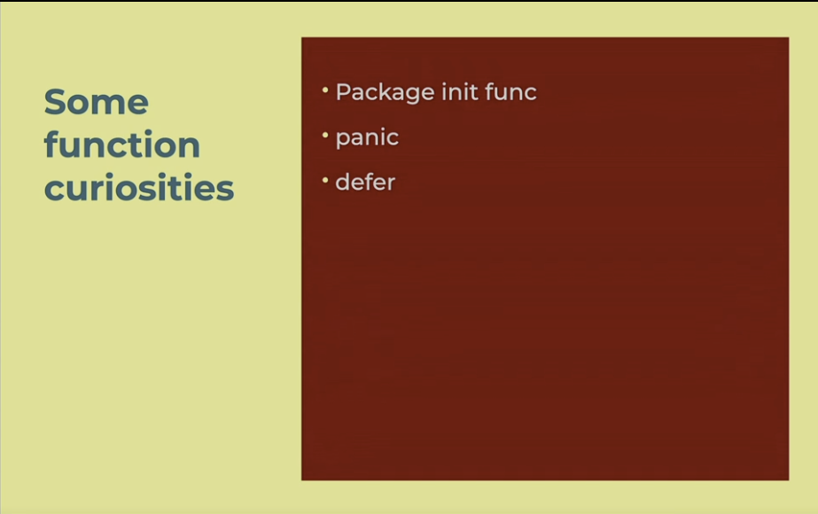
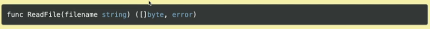

<h1 align="center"> </br> Introduction </h1>

<h3 align="center">This chapter highlights the characteristics of functions in Go, the usage of pointers, less common control flow mechanims, panic and defer and error design patterns, then commonly used control structures. In this chapter Max walks through building a basic calculator project finally, we go over the use of the os std lib to read and write to local files </h3>

###  Table of Contents
  - [Functions](#functions)
  - [Pointers & References](#pointers-references)
  - [Panic, Defer, & Error Design Patterns](#panic-defer-error-design-patterns)
  - [Control Structures](#control-structures)
  - [Calculater Project](#calculator-project)
  - [Read Files](#reading-files)
  - [Writing Files](#writing-files)

---

## Functions



<details>
 <summary>Learn More..</summary>

 - **Functions**
    - Functions can recieve arguments
    - Function can recieve n number of arguments
    - Functions can have default values as args

    - **Functions In Go**
        - Functions can return more than one value (this is similar to function returns in python i.e, `return valOne, valTwo` -> `valOne, valTwo = funcReturningTwoVals(someArg)`)
            - can a functions return type be set to different values like return string or nil
                - No in Go you must return a type, unless you are creating your own types which is more of a design pattern than a Go feature
        - Labeled variables (seen as a bad practice in modern go development)
        - By default functions recieve arguments by value not reference like other high level languages
        - *What does 'recieve args by value and not reference' mean?*
            - by default, when passing a value as an argument to a function in Go you are not passing the reference to the variable that has the value. You are cloning the value from the variable and creating a new reference (variable) with that value (i.e, in js or python args are references to the original variable (for primitive data types))
        - *What if I dont want to copy and I want to pass in the reference? (You do)*
            - To pass a reference to the variable in a go function we have to use [*Pointers](#pointers--references)
        ```go
            // declaring a function
            func save() {} // all functions start with the func keyword

            // passing a param into a function
            func save(text string) {} // param structure: identifier type

            // returning a value
            func add(a int, b int) int { return a+b }
            // add the value type that will be returned after the param block
            // using the return keyword at the end of the function to return the desired value

            // returning multiple values
            func addAndSubstract(a int, b int) (int, int) { return a+b, a-b }
            // add the value types that will be returned after the param block wrapped in parenthesis with each value seperated by a comma

            // using the return keyword at the end of the function to return the desired values seperated by comma
        ```
    - **Pointers Preview**
        - Functions can recieve pointers instead of the value
        - Pointers allows you to pass references to a value instead of a copy of the value as mentioned in the `Function in Go` bullet point above

        -*Why do we want to reference a value instead of copy it?*
            - If the value passed in to the func will be changed

        ```go
        func increment(x *int) {
            *x++
        }

        func main() {
            i := 1
            increment(&i)
        }
        ```
 [Functions Examples](../func-control-err/main.go)

</details>

## Pointers & References

```go
func increment(x *int) {
    *x++  // dereference x and increment the value it points to
}

func main() {
    i := 1
    increment(&i)  // pass the address of i
    fmt.Println(i) // prints 2
}
```

<details>
 <summary>Learn More..</summary>

 - **Pointers**
   - A pointer is a variable that stores the **memory address** of another variable.
   - In Go, pointers are explicitly declared using the `*` symbol before a type, e.g., `*int` means "pointer to an int".
   - Pointers allow you to **reference** a variable's memory location rather than copying its value.
   - This explicit referencing is different from languages like Python or JavaScript, where references are handled implicitly.
   - You can do double pointers which is expressed by prefixing a value with two asteriks i.e `**int`
    - In this case you have a pointer that has a pointer to the value (you have a memory address pointing to a memory address that points to the value)
        - There are niche use cases for this type of behavior so it is not as commonly used
    - **What is a Reference?**
      - A reference holds the **memory address** where the data is stored.
      - In Go, references are explicitly handled using **pointers**.
      - References allow functions or variables to **access or modify** the original data without copying it.
      - This contrasts with passing by value, where a copy of the data is made and modifications do not affect the original.
        - passing by value: passing a param without prefixing with * or passing an arg without prefixing with & i.e `*int`, `&age`

 - **Why use pointers?**
   - You need to **modify** the original value inside a function (pass by reference).
        - Anytime the function will modify the incoming arguments, if you pass in args without using pointers you will make and modify a copy of the arg not the arg itself which makes no sense
   - To avoid copying **large data structures**, improving performance.
   - To share data efficiently between functions or goroutines.
   - To interface with low-level system calls or C libraries.

 - **Passing arguments in Go**
   - By default, Go passes function arguments **by value** (a copy of the variable).
   - To modify the original variable, you must pass a **pointer** to it.
   - This makes side effects explicit and code easier to reason about.

 - **Pointer syntax**
   - `*Type` in a function parameter means the function expects a pointer to `Type`.
   - `*variable` inside the function **dereferences** the pointer to access or modify the value.

 - **Example: Incrementing a value using a pointer**

    ```go
    func increment(x *int) {
        *x++  // dereference x and increment the value it points to
    }

    func main() {
        i := 1
        increment(&i)  // pass the address of i
        fmt.Println(i) // prints 2
    }
    ```
 - **Explanation:**
   - `increment` receives a pointer to an int (`*int`).
   - Inside `increment`, `*x` accesses the value at the address `x` points to.
   - `&i` gets the address of `i` to pass to the function.

 - **Summary Table**

| Concept                 | Go Syntax/Behavior                               | Description                                         |
|-------------------------|-------------------------------------------------|-----------------------------------------------------|
| Pass by value           | `func f(x int)` — copies `x`                     | Function receives a copy of the variable's value    |
| Pass by reference       | `func f(x *int)` — pointer to `x`                | Function receives a pointer (reference) to variable |
| Dereference pointer     | `*x` to access value at pointer                  | Access or modify the value pointed to by a pointer  |
| Get address of variable | `&x`                                            | Obtain the memory address of a variable              |
| Modify caller's var     | Use pointer and dereference                      | Change the original variable via pointer             |
| Passing address example | `f(&x)`                                            | Pass the address of variable `x` to function `f`    |
| Dereferencing example   | `*p = *p + 1`                                      | Increment the value pointed to by pointer `p`       |

[Pointer Examples](../func-control-err/main.go)


</details>

## Panic, Defer & Error Design Pattern



<details>
 <summary>Learn More..</summary>

 - **Package init func**
    _what is init?_
        - intializes some functionality at the start of the application or at compilation time
 - **Panic**
    - Panic is used to abort some function, panic is similar to throwing an error if some condition
    - The panic goes up in the call stack, it will essentially close the application with a message
    - this is not how you handle error management, if an error is expected or can happen within a function panic is not called
    - Panic is used when an unexpected state occurs that the app can not handle/respond too
 - **Defer**
    _what is defer?_
        - to defer something we prefix it with the keyword `defer` i.e, `defer fmt.println("hello from deferred print statement)`
        - prefixing some logic with defer tells the compiler to push this action to the end of the function call regardless of its place in the code
        - `defer fmt.println("hello from deferred print statement)` <- sets the print to the console after all other items in the same function have executed
        - You can have more than one defer, so they can be stacked
            - it operates in a last in firs out execution when stacked

    _notes_
        - This seems to be an opposite of async await where the awaited item puts every other piece of logic to after it is finished
        - typically you use this in situations where you need to close a process after some logic has executed i.e,
            - when opening a db connection you want to follow up with defer on the close connection logic so it executes at the end of any other db logic within the connection function

 - **Error Design Pattern**
    - We dont have exceptions in Go, this is the typical design pattern when an action may trigger an error

    ```go
    func readUser(id int) (user, err) {
        // ... we proceed with the reading and see a bool ok value
        if ok {
            return user, nil
        } else {
            return nil, errorDetails
        }

        func main {
            user, err := readUser (2)
        }
    }
    ```

    - **So how do we handle errors in go?**
        - The above shows us reading a user from a db, we return 2 values
            - a possible user ->
                - if we get a possible user we return the user and nil in place of the error as functions with error handling must return 2 values
            - a possible error ->
                - if we get a possible error we return nil in place of the user and the error Description
            - the error design pattern in go means when we invoke the function we declare it with 2 vars
                - `user, err := readUser(2)` as shown in the code snippet above (this is similar to returning multiple items in python)

 - **Control Structures**
    - if - else
        - go uses regular if else conditional statements
    - switch (reloaded!)
        - switch case statements
    - for
        - There is no while or do-while
        - go only uses for loops even for while true statements for loops are used in a clever way to execute this style of loop,\
    - No parenthesis are needed for boolean
      conditions or values
        - `if salary > 140 {// some logic}`
    - Only one type of equality operators ==
        - no triple equals like in javascript, the only comparison operator is `==`
    - Other operators != < > <= >=

        - *if - else*

            ```go
            if user + nil {
            } else {
            }

            // we can set more than one expression in the if declaration
            // this example means the last statement `user != nil` is the condition being checked
            // we can also create variables in the if condition (this sets the variable in the if and else)
            if message := "hello"; user != nil {
            } else {

            }
            ```
            - _i.e in js this would be_

            ```JavaScript
            const message = "hello"

            if (user != null) {
                // do something
            } else {
                message && ';'
                // do something
            }
            ```

        - *switch*
            - This is a simple switch operation. No break is needed; you can
              fallthrough to the next case, though.

            ```go
                switch day {
                    case "Monday":
                        fmt.Println("It's Monday! ")
                    case "Saturday" :
                        fallthrough
                    case "Sunday":
                        fmt.Println("It's Weekend •").
                    default:
                        fmt.Println("It's another working day @")
                }
            ```

            - the switch will only pick one of the cases that is set
            - fallthrough allows you to automatically fallthrough to the next case

            - we can reduce if else in the switch by removing case and bringing in vars directly

            ```go
            switch {
                case user = nil:

                case user.active = false:

                case user.deleted = true:

                default:
            }
            ```

        - *for loop*
            - it is a multi-purpose loop control structure
            ```go
            // Classic for
            for i:=0; i‹len (collection); i++ {
            }

            // For range, similar to "for in" in JS
            // this brings back the index of the collection NOT the value
            for index := range collection {

            }

            // For range, similar to "foreach"
            // this for loop allows us to bring back both the index and the value
            for key, value := range map {

            }
            ```

            - *how go handles for while - while loop*
            - if the for loop directly calls a boolean it becomes a while loop
            ```go
                endOfGame := false

                for endOfGame {
                // process Game loop
                }

                for count < 10 {
                    count += 1;
                }

                for {// infinite loop
                }
            ```

 - **Calculater Project**
    - _the project covers taking in input from a user and combining this with a switch statement to handle multiple scenarios_

    - Go uses `fmt.Scan` to take input, this works similarly to `input()` in python
        - when running a program in the terminal go will listen for input from the user
        - using `fmt.Scanf()` the input is formatted, scanf takes in two args one for the input type to format and a reference to the var to store the result
        - i.e, `fmt.Scanf("%d", &operation)` where `%d` tells scanf this is a number of base10, when passing in the var go uses pointers to _reference_ the var declared so it can be updated and returned, *without the &/pointer reference this scanf would create a copy of the operation var and the program would not work*
    - Go uses switch case to handle multiple conditions
        - in this example the operation is set based on the input from the user

        ```go
         switch operation {
            case "add":
                fmt.Println(number1 + number2)
            case "subtract":
                fmt.Println(number1 - number2)
            case "multiply":
                fmt.Println(number1 * number2)
            case "divide":
                fmt.Println(number1 / number2)
        }
        ```

    - [reference to the calculator project](../func-control-err/Calculator/main.go)

 - **Reading Files**
  - **How can we read files in Go?**
    - go cli gives quick access to the documentation
        ```bash
            go doc os WriteFile
        ```
        - this returns some info about the WriteFile function from go std library
    - we can use reading files for text based, json and binary files
        - to read/write files in go use the package from the go standard library
            - [io/ioutil](https://pkg.go.dev/io/ioutil@go1.20.5#ReadFile)
            - i.e, the func from the std lib ReadFile is uses to read the file named in the func and return its contents ->
            - it takes in 1 arg, the file name, and returns two items, the file contents in bytes and the error (following the go error design pattern a possible value and a possible error should be returned)
            
        - to read/write folders/directories use the package from the go standard library
            - [io/fs](https://pkg.go.dev/io/fs@go1.24.3)
        - *note*
            - the io version is depracated, use the os version although this tutorial uses the io version
            - they function the same, the functions were simply move to the os package

    - **Writing Files**
        - **How can we write files in Go?**
        - Writing files in go is similar to reading them


  - **Understanding our own file system**
    - when creating packages in go, it is not the folder/directory name that dictates the package name
    - it is the package declaration at the top of the files within a folder that sets the package name
        - i.e
            fileutils -|
                    reader.go - package lib
                    writer.go - package lib
        - in this example, even though the directory name is fileutils, both `reader.go` and `writer.go` belong to the `lib` package
        - the key is that all files within the folder must share the same package name in order to be apart of the package
        - this means the directory name can change without effecting the code itself
    - in go, the name of the go file doesnt matter, we can change our file names and not worry about making updates to imports etc. like in js
        - the name of the package matters as that is whats imported and referenced throughout the module
            i.e in a main.go file, import the fileutils package from `fileutils` dir
            ```go
             package main
             import "stratumlabs.ai/go/files/fileutils"

             func main() {
                c, err := fileutils.SomeFuncInPackage()
             }
            ```
        - main.go did not need to reference the file to import the package into main.go just the package itself
        - package format - `module-name/package`

    - any file that is not a go file, will be ignored by the go compiler
        - i.e a data.txt file will not get picked up

    - *what about packages in sub folders?*
        - In go, you do not set packages within packages
        - packages are declared at the top level
        - there are mechanisms for doing this i.e `internals` but it is not a common practice in go

    - *setting aliases when importing packages*
        - `fio "stratumlabs.ai/go/files/fileutils"
            - this sets fio as the reference to the package so it is called `fio.SomeFuncInThePackage()` instead of using fileutils

    [reading files full reference](../func-control-err/files)


</details>
