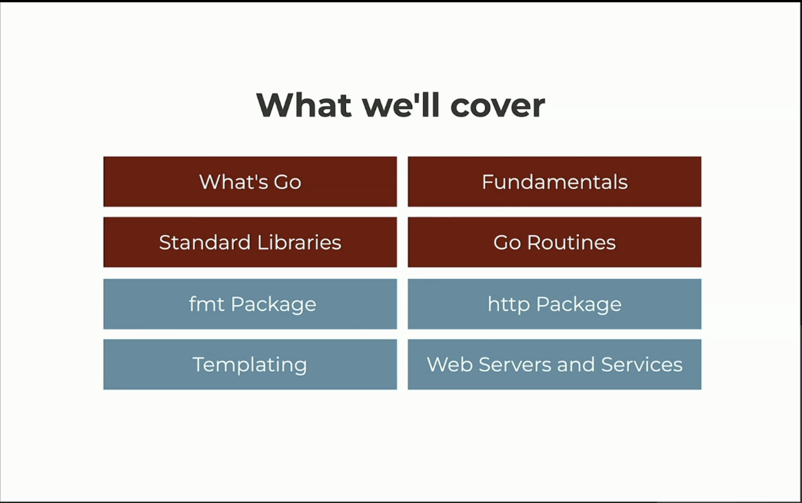

<h1 align="center">   Introduction </h1>

<h3 align="center">This chapter introduces the instructor and covers what to expect from this course</h3>

###  Table of Contents
  - [Max](#maximiliano-firtman)
  - [What we'll cover](#what-we'll-cover)
  - [Prerequisites](#prerequisites)

---

### Maximiliano Firtman

Max has been working with go around 7 years ago

### Max's Website with more courses :  [firt.dev](https://firt.dev/)

### What we'll cover

1. What is go and why is it important
2. Go fundamentals like syntax: The go language is pretty simple!
3. Standard Library: The go built in libraries, which reduces the amount of 3rd party libraries needed to build applications
4. go-routines: how concurrency in go works
4. packages:
    - fmt
    - http (consume data from the web, get information from an api, parse data (JSON))
    - web servers and services
    - templating (mix html with go in the middle, serving static files to a cdn etc.)

### Prerequisites

### You will need to download go: [go.dev](https://go.dev/)

### You will need an IDE: [Cursor](https://cursor.com)
