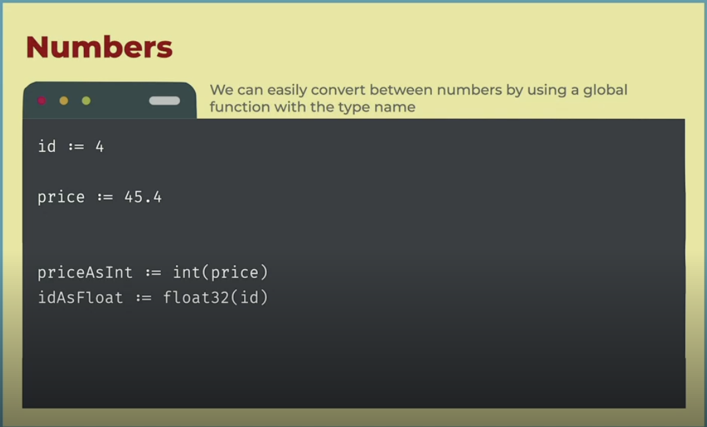

<h1 align="center"> </br> Variables, Constants & Data Types </h1>

<h3 align="center">This chapter covers fundamental syntax rules and project structure of go, creating and running a multi-module, go's capability to infer data types, working with packages (function scope, accessing data from imported packages), finally it touches on arrays, slices and maps</h3>

###  Table of Contents
  - [Go Basics Overview](#go-basics-overview)
  - [Create a Go Module](#create-a-go-module)
  - [Variables, Types, Const](#variables-types-const)
  - [Data Types](#data-types)
  - [Packages](#packages)
  - [Packages Q&A](#packages-q-a)
  - [Visibility](#visibility)
  - [Numbers & Collections](#numbers-&-collections)

---

## Go Basics Overview


<details>
 <summary>Learn More..</summary>

 - **Language Types**
    - Interpreted Languages -> Source Code `JS` `Python` `Ruby`
        - You write code and ship source code.
    - Intermediate Compiled Languages -> Bytecode `Java`
        - These languages compile and then ship to bytecode, this allows it to run on any os without specification `JVM`
    - **Compiled Languages -> Machine Code** `Go`
        - These languages compile and ship machine code for one cpu within the context of one os, these languages require you to specify the cpu & os to run it across platforms
    - **Go Language Types**
        - Go *ALSO* can be shipped in all three formats
            - Source code (transpiling into javascript)
            - bytecode (webassembly code)
            - machine code (what this course covers and most go applications in the wild will ship machine code)
    - **Note**
        - Go is more comparable to C than javascript overrall, thus the machine code use over source or bytecode
- **Basic Rules**
    - we use .go files
    - we use code blocks {}
        - we dont care about identation, spaces or tabs like python
    - no styling freedom
    - We do have semi-colon to seperate statements
        - only used if defining statements in the same line (optional)
        - new lines do not automatically mean new statement (the compiler understands the difference usually if rules are followed generally speaking)
    - case sensitive
        - named variables with lower case or upper case have different meanings
    - strongly typed
        - few use cases for dynamic typing
    - NOT an object-oriented language
        - no classes, no objects, no inheritance etc.
    - No exceptions
        - no try catch
        - go has a way to throw errors but not using exceptions
    - We have one file acting as the entry point (the main function)
    - A folder is a package
        - packages can have simple names, services, utily, data, llm (typical folder names)
    - Within one .go file we can have
        - variables
        - functions
        - type declarations
        - method declarations

- **Modules and CLI**
    - A module is a group of packages
        - a go module is simply a project or complete go application
    - Its our project
    - It contains a go.mod file with configuration and metadata

    - CLI manipulates the module
        - go mod init
        - go build
        - go run
        - go test
        - go get

</details>

## Create a go module


<details>
 <summary>Learn More..</summary>

 - **How do you create a module?**
    - Create a new folder using your IDE or terminal
        - if using terminal run
        ```bash
        mkdir <module-name>
        ```
    - Now we are going to use the go cli to create the module
        - cd into the folder and run (terminal required)
        ```bash
        go mod init <module-name>
        ```
        - Naming convention can follow typical server application naming structure <app-services> <server> <backend> etc.
        - Optionally we can use a url to set the name, and this url does not have to exist on a network it is just a name set as a url i.e all of your modules can be prefixed with a company name `stratumlabs.ai/go/io`

    - Once you execute this command, a `go.mod` txt file will be created
        - This file contains all the metadata for our module, it should look something like this when initialized ->
            ```txt
            module stratumlabs.ai/go/io
            go 1.24
            ```
            - The name of the module
            - The version of go you want to use

        - Want to change the name of the module?
            - We can change the name of the module from this file by simply changing it!
        - Want to change the version?
            - We can change the version from this file by simply changing it!

    - *Summary*
        - So how do you create a go module?
            - you simply need a text file named go.mod with some go module metadata in the root of your project directory
        - The go.mod is similar to package.json in the javascript world, it will include any dependencies we bring in to our application similar to package.json

- *Whats the difference because we have a module*
    - To run our file from the first chapter, we used `go run <filename>` and the file name was mandatory to run the script/code in that file
    - Because we have a module we have more flexibility with how our code is run
        - i.e we can say I want to run code in this module, we can use `go run .` the . specifies the current module and go cli looks through all the files and looks for a package main with a function main. *this can be run from anywhere in the project and the main function can live in a file with any name, go cli will find the main function and run the module*
        - It is best practice to call the main file main.go but it is not mandatory, the only thing needed is `package main` `fun main() {}`

- *Workspaces and CLI*
    - Overview
        - In the first version of go, workspaces existed but it was deprecated
        - 1.18 workspaces were reintroduced

    - Workspaces
        - A way to manage multi module go applications, workspace is like a super module
        - It is a simple structure, you have the folder with several folders that will have several modules
        - Most applications in the wild are not multi-module so they dont have a workspace
        - it contains a go.work file with config metadata including which module to use

    - CLI
        - cli manipulates the worksapce
            - go work init

 - [inputoutput](../var-const-data/INPUTOUTPUT/) is the module example created for this section

</details>

## Variables, Types, Const


<details>
 <summary>Learn More..</summary>

 - **Variables**
    - How do you declare a variable in go?
        - variables are declared using the var keyword, followed by the name of the variable then the type of value expected to be stored in the variable
            - i.e, `var x int` (var keyword, x is the name of the variable, int is data type the value of the variable should be)
            - i.e, `var name string` (var keyword, name as name, string is data type)
                - the var keyword is the only keyword go uses for variables
                - var keyword is followed with the identifier or name of the variable
                - the identifier is followed by the data type (no colon between name and type needed just a space)
                - any variable without an assignment (var x int, var name string), they will be assigned a value of nil by default (null or None)
    - How do you declare a constant in go?
     -  constants are declared using the const keyword, followed by the name of the variable then value assignment
        - i.e, `const y = 2` (const keyword, y as name, = 2 assigns the value 2)
            - declaring constants is similar to variables as it needs the const keyword, that is the only keyword go uses for constants
            - the const keyword is followed with the identifier or the name of the constant
            - then you assign the constant, when declaring constants we HAVE to include a value
            - constants can only be bool, string or numbers nothing else
                - constants in go are different than in js
                    - in js constants are set as immutable variables, which means it is a variable (a space in memory) that can not be changed (some engine checking that the value is not changed). Because it is just a space in memory you can assign any value, and the value simply can not be changed
                    - in go constants are constants which are fixed values, not a space in memory.
                    - when the compiler finds a constant referenced, it goes to the definition copies the value and pastes the value, with an exception for strings
                - you will not use const alot in go (urls, domains). Only things that will not change after compilation as a constant can not set its value at run time
        - `var z int = 2`
            - we can declare variables with a value
        - `var text string`
        - `text = "hello!"`
            - we can declare variables without a value and assign the variables value later
            - strings will use double quotes, go does not recognize single quotes

        - `otherText := "Bye!`
            - we can use a variable value initialization shortcut
            - using := (walrus operator), this will create the variable for you and allow you to assign the value in one line
            - we dont need the var keyword
            - we dont have to explicitly set the data type, it will be inferred from the value assigned i.e this var will have a data type of string
            - this is used when you want to create the variable and assign a value
            - this syntax only works within functions, you can not set a global variable this way

[variable code examples](../var-const-data/INPUTOUTPUT/variable_declaration_examples.go)

</details>

## Data Types


<details>
 <summary>Learn More..</summary>

 - **string**
    - strings are declared with lower case s
    - a string is a sequence of characters similar to text wrapped in double quotes

- **integer values**
    - int (alias for int32)
    - int8, int16, int32, int64 (signed integer - can store from -127 to 128. if you want to set the amount of bits it will use in memory, this also sets the min and max that you can store there)
    - uint (alias for unit32)
    - uint8, uint16, uint32, uint64 (unsigned integer - can only store positive numbers from 0 - 155)

- **floating point values**
    - float32, float64 (in go and web, json every number in json will be converted to float64 so this will be commonly used with json data)

- **bool**
    - accepts true of false
    - *Boolean Operators*
        - == (equals),
        - != (not equals),
        - < (less than),
        - (> greater than),
        - <= (less than or equals)
        - (>= greater than or equals)
        - && (and)
        - || (or)
        - ! (not)

- **pointers**
    - lets say we have a variable we declared, then we create another variable that is pointing to the original this creates a link between our new variable and the old
        - pointers are simple in go, not as low level as c or c++

    [Jump to Pointer Full Section](../func-control-err/README.md/#pointers--references)

</details>

## Packages


<details>
 <summary>Learn More..</summary>

 - **What is a package?**
    - a package is simply a group of files within the same folder
    - when creating a file that should belong to a specific package
        - we define the name of the package the file should belong to at the top of the file i.e `package main` <- here main is the name of the package
        - the only condition is that any files belonging to the same package must all be in the same folder
        ```bash
        └── inputoutput
            ├── go.mod
            ├── main.go
            └── service
                ├── service-package-file-1.go (package service)
                └── service-package-file-2.go (package service)
        ```
    - We can import/use multiple other packages in these files
        - To do this we use the import keyword and in quotes the name of the package, also written at the top of the file but under our package declaration i.e `import "fmt"` (this imports the format package from go std library) so `import "package we want to import"`
            - The package we import can be..
                - a built in package from go std lib like the example above
                - our own package that we have created within our project
                - a dependency we are downloading from the web
        - Your files will look something like this
            ```go
            package main // this file belongs to the main package (every file must be apart of a package so this line is mandatory)

            import "fmt" // import the fmt package from go std lib

            func main() {
                fmt.println("Hello World") // this line makes use of the fmt package we imported
            }
            ```
        - *Using imported code*
            - when we import packages, everything the package is exporting will be available under the name of the package which we can access using `.` syntax
                - i.e, if we want to use some code from the fmt package we write `fmt.Println` *writing fmt. in your editor will bring up a full list of exported functions, variables and types that are callable from the package*

        - *What about sharing code between files in our package?*
            - In Go, we don't have to use import statements to access the code from other files if the files are apart of the same package unlike in python and js environments, in js or python, to use code from one file in another you must import it i.e, `from file import function` or `import { function } from file`
                - in Go, when sharing code like functions, package variables, constants and data types between files that are apart of the same package, you simply execute the code, you do not use import statements
                    - This is because the compiler actually combines all code from the files that belong to the same package into one

            - Your files will look something like this
                - main.go
                ```go
                package main

                var name string = "Stratum Labs" // package variable

                func main() {
                    print("Hello From Main")
                    printData() // the main.go file knows this function exists because functions.go is apart of the main package
                }
                ```
                - functions.go
                ```go
                package main

                func printData() {
                    print("Hello")
                    print("From Functions")
                    print(name) // the functions.go file knows this variable exist because main.go is apart of the main package
                }
                ```
        - **What about sharing code between files in different packages?**
            - *In go we use TitleCase and camelCase to set code as public and accesible to files in other packages or private and only accessible to files within the same package*
                - *Public* code (accessible to itself other files within the package AND files outside the package/in other packages)
                    - if the variable or function is created with an uppercase letter (*TitleCase*) it is public and therefore accessible **outside** of the `package` (i.e, `PrintData()`) this would make the PrintData function available outside of the main package and callable i.e, `main.PrintData()`
                - *private* (only accessible to itself and other files within the same package)
                    - if a function or variable is created with a lowercase letter (*camelCase*) it is only available to itself and other files **within** the `package`. The current declaration of printData will only be accessible within the package
                - *Summary*
                    - We don't have the concept of keywords to set visibility of functions or variable like we do in Java, c# etc. those languages use, `private function() {} ` or `public void main() {}` etc.
                    - Go simply uses the capital case convention to set visibility

 - **print functions**
    - *Unsafe print*

        *print and println are not commonly used, in production these functions are not safe and are not gauranteed to run on every platform making them useful only during development*

     - *print()*
        - this print function will print to the console without formatting (creating new lines adding spaces etc.)
        - thinking about the printData() func above, your console with look something like this
        ```bash
        HelloFrom FunctionsStratum Labs
        ```
     - *println()*
        - this print function will print to the console and create a new line for any print statements that follow
        - thinking about the printData() func above, if we keep print for the first statement, use println for the second and third, your console should look something like this
        ```bash
        HelloFrom Functions
        Stratum Labs
        ```
    - *Safe print*

        *The safe way to print uses the 'fmt' package which we import to our file, `import fmt` (fmt is shot for format)*

        - *fmt.Println()*
        - *fmt.Print()*
        - *fmt.printf()*
            - f stands for format, using printf creates a templated string
            - printf accepts any amount of arguments
            - your code will look something like this
            ```go
            fmt.printf("This created a templated string with values %v and another value %v\n", v1, v2)
            ```
                - use \n to create a new line


- **comments**
    - For comments we use C based comments, using `//` and `/**/` we can initiate a comment
        - `// this is single line comment in go`
        - `/* this is a multi-line comment in go */`
        - comments do not execute or run as code, it is there for our reference only
            - use cases
                - comment out code you dont want to execute
                - annotate some logic you want to explain to others or yourself in the future


[package code examples](../var-const-data/INPUTOUTPUT/functions.go)

</details>

## Packages Q & A


<details>
 <summary>Learn More..</summary>

 - We dont typically import packages manually
    - if we start typing fmt and press enter for example the IDE will add the import for you
    - if you do not press enter, the IDE will show an error on the package called and offer a quick tip to install
    - The file must be saved in order to resolve any errors
    - Enable auto save to help mitigate (most people are not in favor of autosave)

- Imports are not per package, they are per file, meaning each file that wants to use a package should import the package

- *Importing from other packages within the same project*
    - First any code to be exported needs to start with uppercase i.e `const MaxSpeed = 60`
        - the package export should look something like this
        ```go
        package data // the package name will match the folder name

        const MaxSpeed = 60 // declare the constant using uppercase makes it available to other packages within our project
        ```
    - Importing code from packages that we make within the same project looks different from std lib or web package import `import "name of package"`
        - To import from packages created in the same project -> import "module id/package name" i.e, `import "stratumlabs.ai/go/io/data"`
            - find the module name in `go.mod` next to module
        - The package import should look something like this

        ```go
        package main
        import "stratumlabs.ai/go/io/data" // data is the package we are importing from, since it is a package within the project data must be prefixed with the module id

        func main() {
            // the package name and end of the import string is called and using dot notation MaxSpeed is available to use from the data package in the main package
            fmt.println(data.MaxSpeed)
        }
        ```
        - The import statement can be updated with an alias if the package name is not preferred i.e ->
            - `import data2 "stratumlabs.ai/go/io/data"`


[exporting between packages example](../var-const-data/INPUTOUTPUT/main.go)
</details>


## Visibility


<details>
<summary>Learn More..</summary>

 - **what we write in a module**
    - TitleCase and camelCase determine code visibility
        - TitleCase = Public
        - camelCase = private

- **Variables and lambda functions**
 - They have 3 different scope levels that determine where they can be acessed from first within the file they are declared then outside of the file
    - Module Scoped
    - Function Scoped
    - Block Scoped
- *What are lambda functions?*
    - simply a function
         - this function can have a name, sometimes it will have no name
         - we can create a link to this function that is a variable


</details>

## Numbers & Collections



<details>
<summary>Learn More..</summary>

 - **Operations on Numbers**
    - Go does not have automatic conversion between types
    - If performing a math operations over an integer and float you have to convert the types before hand (i.e `int(45.4)` 45.4 is a float now converted to an int or `float32(4)` 4 is an int, now converted to a float)
    - Conversions only work on certain types i.e a string will not be converted to a bool

- **Strings**
    - Go strings are  multi strings by default, in languages like JS multi line strings are set with back ticks only
    - Although go strings are multi line by default, back ticks are used and are the preferred/ best practice way to create multi line strings

- **Collections**
    - **What is a collection?**
        - a built in composite type used to group data aka a data structure used to store a group of like elements/values
    - *Arrays*:
        - what is an array?: a sequence/list of elements, can be numbers, strings, a list of maps etc. i.e, `var Countries [10]string`
        - In Go arrays have a fixed length
        - `[5]int` <- this is the array type definition which sets the length of the array to 5 elements and sets the types of values that can exist in the array to integer
            - fixed length means this array with have only 5 elements and no more, we can create a new array and add additional items but we can never add more than 5 items to the array we declared
            - to get the length of an array use the global len() function, the logic may look something like this
            ```go
            qty := len(Countries)
            ```

    - *Slices*: i.e, `var Slice []int`
        - what is a slice?
            - Slices are arrays with a dynamic length
            - `[]string` <- this is the slices type definition, it sets the length of the array to dynamic and sets the type of values that can exist in the array to integer
            - to get the length of a slice use the global len() function, the logic may look something like this
            ```go
            qty := len(Slice)
            ```
        - behind the slice they are actually fixed length array, in other words slices of arrays i.e arr[:2] this is a slice of an array from 0 index to the 2nd index

    - *Maps*: key/value dictionairies i.e `wellKnownPort := map[string]int { "http": 80, "https": 443 }`
        - a Go map is similar to a python dictionary or JS object,
        - `map[keyType]valueType` this is the map type definition which sets the variable value as a map
            - (it takes in the value expected for the key in the square brackets and the value expected for the value outside i.e -> `map[string]int`)
        - Maps are JSON compatible

    - *Generics*:
        - https://go.dev/blog/intro-generics

    - **Init Functions**
      - init functions are a way to ensure a valid state is set for package-level variables i.e our declared collections
      - A file can have multiple init functions, setting and initializing different things, multiple files within the same package can have multiple init functions as well
      - It is automatically invoked once per package before the ⁠main function (or when the package is imported).
        - This allows any state/vars to be set before the application runs
    - the init function will look something like this
        ```go
        func init() {
            print("Initialize some variables")
        }
        ```
 - [collections & Init functions example](../var-const-data/INPUTOUTPUT/data/collections.go)
 - [Init functions example](../var-const-data/INPUTOUTPUT/main.go)

 

 <details>
 <summary>Learn More..</summary>

 - *Global Functions*
    - we use global functions to work with collections
        - this is similar to python len() etc. methods
        - i.e, use append() to add an element to a collection
            - the code will look something like this
            ```go
            // Slices

            names := []string { "Mary", "John" } // declare and assign 2 elements to the names slice
            names := append(names, "Carol") // append takes in the original slice and the new elements as params i.e, append(slice reference, element to add)
            println(len(names))
            ```
            - This code example reassigns names to a new slice with "Carol"
                - In this example we have a slice with 2 elements and want to add a new one, so we reassign names and create a new slice, now with 3 elements.
                    - So in Go using functions like append do not change the original slice but creates a new one
                - does this mean we can keep the original slice in tact and use append to bring in elements from names and create a new slice called newNames i.e
                    ```go
                    newNames := append(names, "Goerge")
                    ```
                - keeping the names slice and creates a new slice newNames?

    [Full list of builtin Go Functions](https://pkg.go.dev/builtin@go1.24.3#pkg-functions)
</details>

</details>
