<h1 align="center"> </br> What is Go? </h1>

<h3 align="center">This chapter provides a brief overview of the history of go, its characteristics, go.dev, setting up go and the go philosophy</h3>

###  Table of Contents
  - [History Of Go](#history-of-go)
  - [Characteristics & Timeline](#characteristics-and-timeline)
  - [Go.dev Overview](#go-dev-overview)
  - [Philosophy & Tools](#philosophy-and-tools)
  - [Go setup](#go-setup)
  - [Multi-Platform & Common Use cases](#multi-platform-and-common-use-cases)

---

## History Of Go

### What's Go?
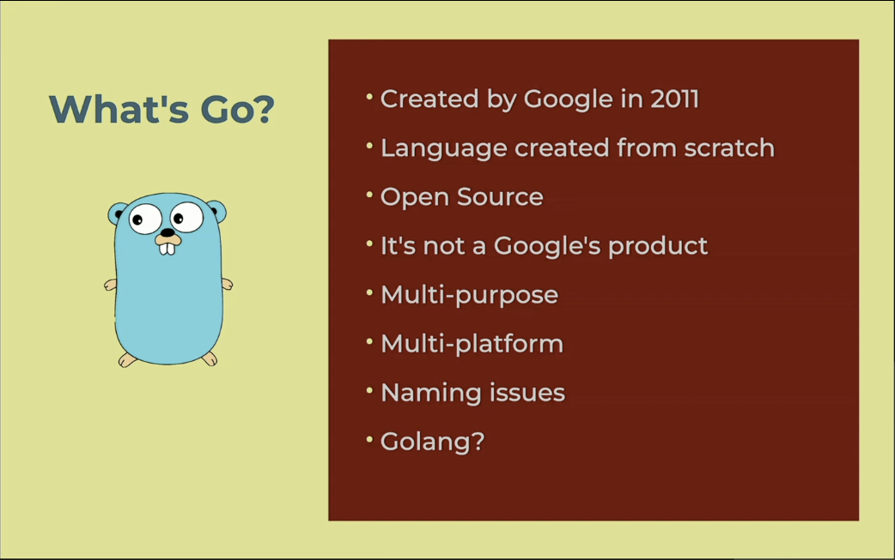

<details>
    <summary>
    Learn More..
    </summary>

  - **It was created by google in 2011**
  - **It was created from scratch, not based on java, c or any other language**
  - **it is open source**
  - **its not googles product**
    - i.e angular is googles product they market, sell and maintain this internally
    - go is open source, acts seperately from google and is community maintained
  - **Multi-platform, Multi-Purpose**
    - It does not have a specific purpose, similar to python it can be used for any task
    - The code we compile works on all os (windows, macos, linux etc.)
  -  **Naming issues**
      - This is not the first language with the name go, i.e go!
      - google took the name despite the existing coding languages with the name
      - Golang was used to differentiate go from other go languages on web search (og site was golang.com)


</details/>

### Who are the creators?
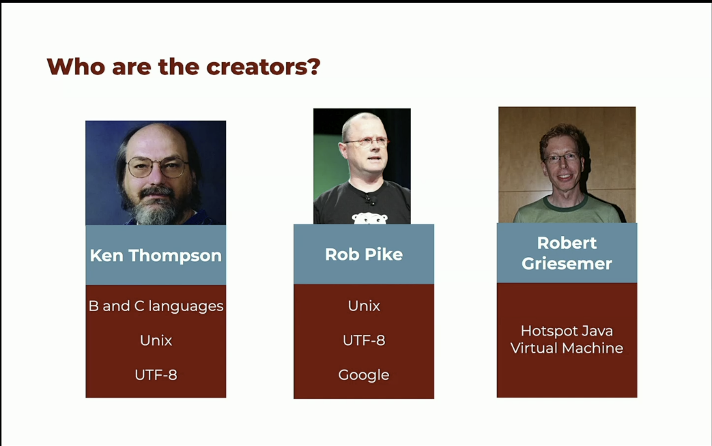

<details>
    <summary>
    Learn More..
    </summary>

- **Ken Thompson**
- **Rob Pike**
- **Robert Griesemer**

- **Why Ken, Rob, Robert?**
  - They all have alot of low level knowledge and experience
  - Go appeared in the dev space when there were alot of languages being created (2014,2015)
  - Although there were already alot of languages in play, there was still a need for a new type of language that covers modern needs of web based development at scale

</details/>

</details/>

### Why Go?

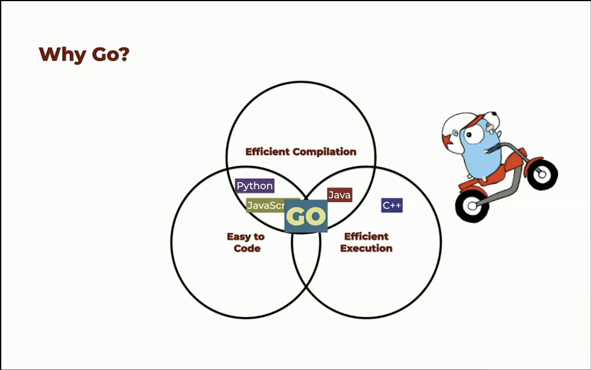

<details>
    <summary>
    Learn More..
    </summary>


- **Easy to code**
  - Mainly means, easy to read. languages should not have obscure things that convolutes understanding of what the code is actually doing
  - Means Go is opinionated and makes design decisions so developers are not making alot of decisions about how to write code, creates consistency across how things are implemented

- **Efficient Compilation**
  - One of the main problems in modern languages is compilation
    - i.e in node the browser compiles javascript code and this causes performance issues due to the time it takes to compile
  - on large backend systems, with java, .net (most other languages), with multiple developers working on it the compilation times are high (each dev may spend 10-15 minutes compiling bug fixes and implementations)
    - Often times due to dependencies etc.

- **Efficient Execution**
    - We need to scale easily, (10 - 10m users) should scale, this requires efficient execution speed
    - In dynamic languages the execution speed is slower

- **How other languages stack against the three goals**
  - Java is not easy to code (alot of beurecrecy around writing code, too much boilerplate) even though it is efficient at compilation and execution
  - C++ is not easy to code and compilation is an issue even though the execution time is great
  - Go fulfills all three of these goals
    - keep these goals in mind when learning go, some decisions were made to ensure all three goals are met (i.e, no inheritance, no classes etc.)

</details/>

## Characteristics and Timeline

### Characteristics

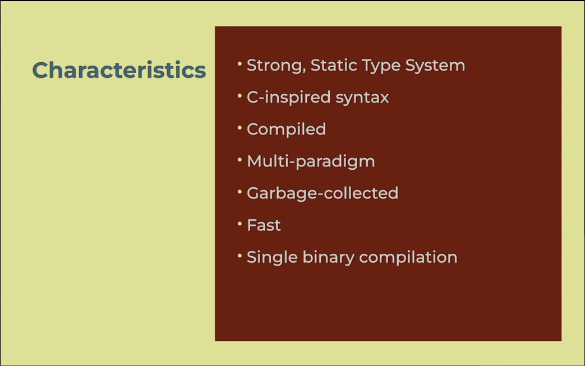

<details>
    <summary>Learn More..</summary>

  - **Strong, Static Type System**
    - Everything will have a type, integer are integer not string
  - **C-Inspired syntax**
    - Not built on top of C but some syntax and practices follow C,
      i.e - the if and condition statements are followed by curly braces
  - **Compiled**
    - The developer is responsible for compilation of the code in order to execute, go will not run unless compiled
  - **Multi-Paradigm**
    - The idea is to keep Go simple, is it OOP language? Functional? A specific paradigm is not actually enforced in go so it is up to you how you implement the architecture
  - **Garbage Collected**
    - Go comes with a garbage collection mechanism (simple process that looks at your memory that no one is pointing at, so GC will delete this data)
    - Garbage Collection: Getting rid of items stored in memory that are no longer needed automatically, you as the developer do not have to worry about clearing memory
      - i.e in Rust, C if you create something you are responsible for deleting something, if not you create memory leaks (pieces of memory that are occupied with data but no one is using the data, overtime your cpu memory is occupied and can cause blocks or crashes etc.)
  - **Go is Fast**
    - Go is faster than any other language used for web services, micro services
  - **Single Binary Compilation**
    - single binary file is created, one executable for our workers


</details>

### Timeline

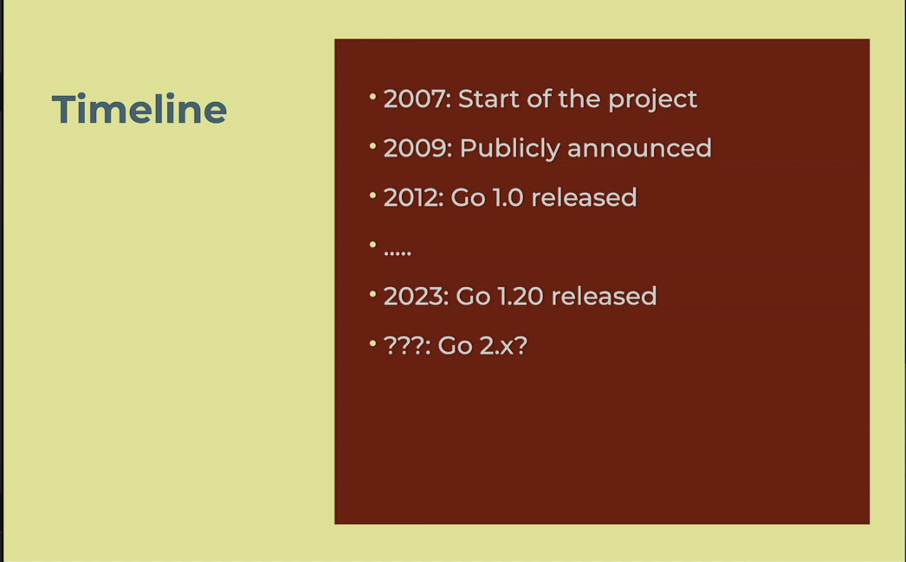

<details>
    <summary>Learn More..</summary>

   - **Version as of this course**
    - *1.24.0* (2025)
  - **Gos Release Rules**
    - 2 or so version updates per year, with minor updates (increasing func perf etc.)
      - some new feauture additions (i.e in version 1.18 go introduced generics)
    - As of Go 1.x it is said every release should always be backwards compatible
      - To reduce risks
      - Reduce developer stress and anxiety around keeping up and keeping codebased up to date and compatible
      - Vulnerabilities are an exception to backwards compatibility as the fix may require a change to the api etc.
  - **Deciding on upgrades**
    - Look at release notes and determine if updates are needed for your implementations
  - **Go 2.x?**
    - It shouldnt force developers to move to Go 2
    - Go 2 is currently a parallel experience to determine if they can do something new and better, really a different language that ofcourse would not be backwards compatible
</details/>

## Go Dev Overview

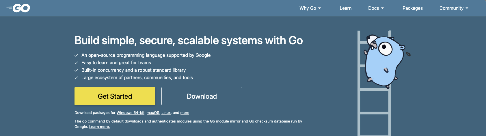

<details>
    <summary>Learn More..</summary>

<!-- ### [go.dev](https://go.dev) -->
  - **why [go.dev](https://go.dev)?**
    - Most languages and frameworks moved .com and .org into .dev, when this happened (around 7 years ago) go dropped the golang.
    - This improved searchability with using just go instead of golang
  - **Important Tips**
    - *Documentation*
      - Effective Go
        - Its a way to get all information on go, in an ebook format
      - User manual
        - Is not really well written, it may be too context dependant, if you are not apart of the team it feels like it may be difficult to digest the content
      - Standard Library
        - It can be better, but it lists all the functions, properties, methods etc. available in go std library (go api)
        - This directory is complete so serves as a good reference
    - *Learn*
      - Downloads
        - For mac it is important to download the appropriate version (intel vs silicon) as go will not work if installed incorrectly
          - arm64 = silicon
          - x86 = intel
      - Tour of Go
        - This is a good way to learn go basics
          - it offers a playground (online text editor) that allows you to interact with go and learn the fundamentals without downloading go
          - It covers nearly 100% of the language as go is pretty small compared to other languages
</details>

## Philosophy and Tools

### Who is using Go?

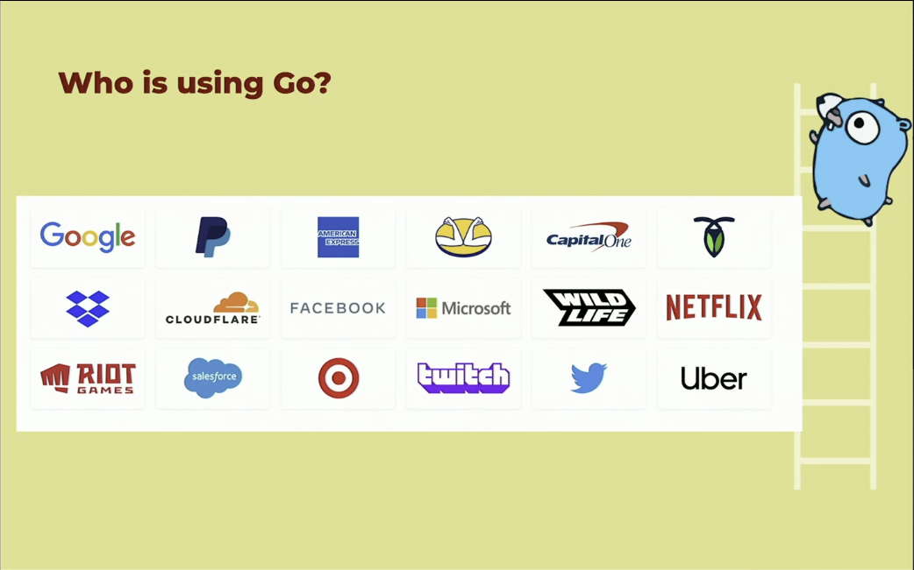

<details>
  <summary>Learn More..</summary>

  - *Use cases*
    - Companies are using go for backend development (micro-services, web services etc.)
      - Companies are moving individual parts of the stack to go
      - Companies start most new projects using go
</details>

### Values and Philosophy

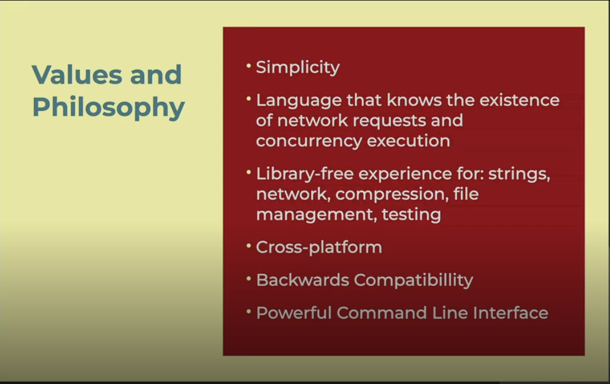

<details>
    <summary>Learn More..</summary>

  - *Simplicity*
    - The language itself is simple, using the standard library is simple etc.
  - *Networking & Concurrency Execution*
    - From scratch we know we will use a network, so its apart of the core library.
    - Concurrency is also baked into go, how to build services that can do work in parallel was thought about when creating go to solve the problem of threading, which is completely different from other languages and it is much simpler to get concurrency execution working
  - *library free*
    - strings, testing, compression, file management, network are all apart of the std library (all things needed to work with the networking layer and process data should be apart of the std library)
  - *Cross Platform*
    - works with multiple os
  - *Powerful CLI*
  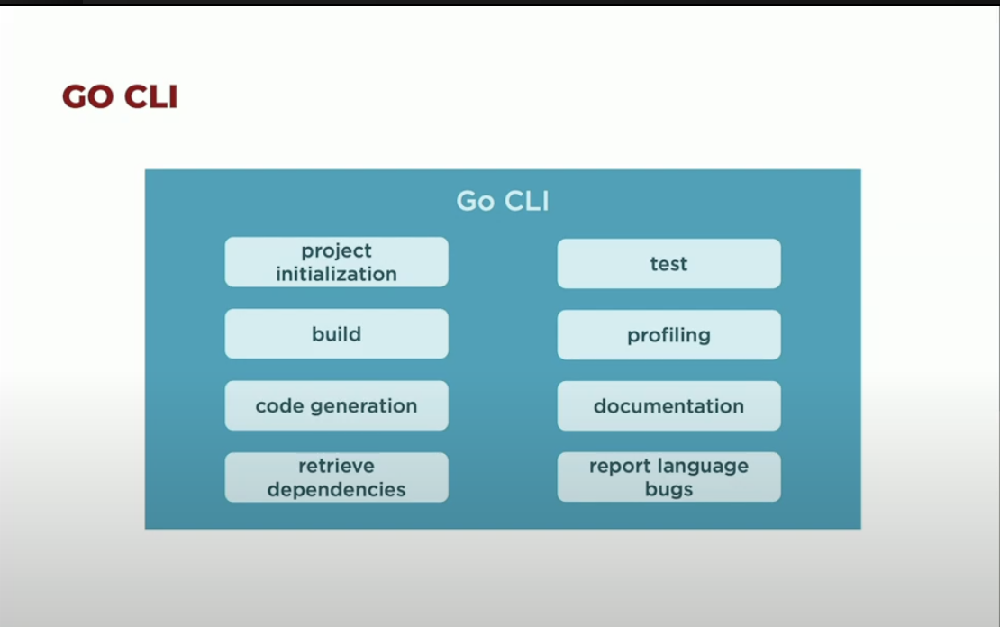
    - initialize projects with the cli
    - read documentation using the cli
    - no need for a test runner, simply use cli
    - most ides are integrated with these tools but it is nice to have the cli to handle them as well
</details>

### Tools
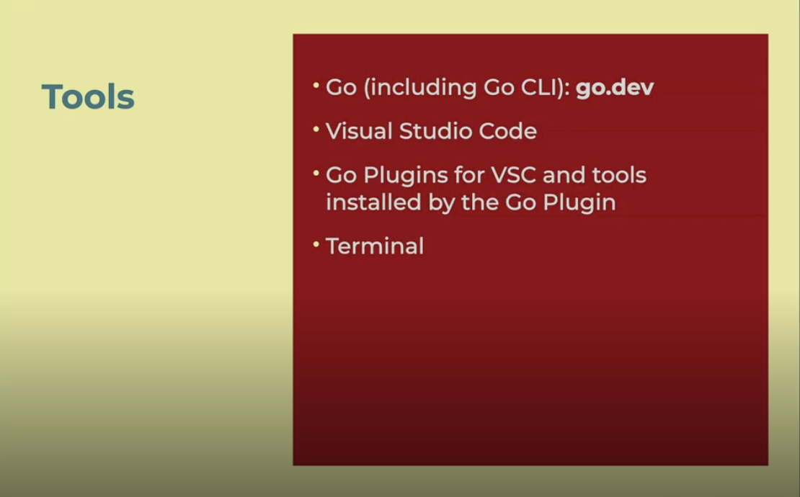
<details>
  <summary>Learn More..</summary>

  - Go cli is included with go download from
  [go.dev](https://go.dev/dl/)
  - your IDE of choice [Cursor](https://cursor.com)
  - Go Plugins (vs code/cursor extensions)
    - official go plugin [Go](https://marketplace.visualstudio.com/items?itemName=golang.Go)
      - linter (a static analyzer that points out common code syntax, style guidelines, small errors)
  - Confirm go is installed correctly (in terminal run)
    - `go` pull up the go helper menu
    - `go version` check your installed go version
</details>

## Go Setup
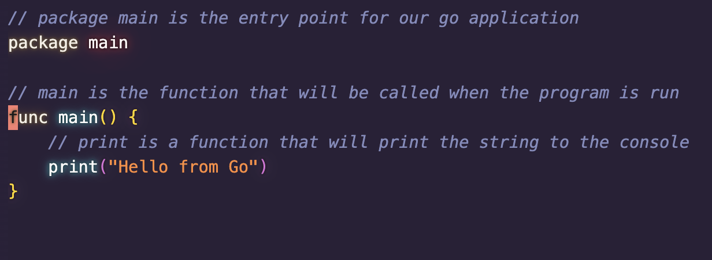
<details>
  <summary>Learn More..</summary>

  - Install the official Go Ext. for VSCode If you did not in the tools section -> [Go](https://marketplace.visualstudio.com/items?itemName=golang.Go)
  - Create your first go file

    

      - if you see the logo, the plugin is working
      - you can also see the version and language vs code is interpreting from the current file (it should say go and the version you downloaded)
      - When you create your first .go file, the extension will prompt you to install more tools


  - Lets write some go!
    - 99% of the time we will create modules (packages) to write go but
      - The go runtime allows us to run standalone go scripts (same as python, perl etc.)
        - although go is a compiled language it can be used for scripts where compilation happens on the fly in memory
    - In our `first.go` file, if it is empty we will likely see an error, this is because every file in go needs to belong to a module (package) *our go extension recognizes when we are not following the `go` rules!*
      - what is a package? lets say a package is a folder for now
        - there is only one package that does not have to be apart of a folder and that is `package main`. We simply add package main to the top of our `first.go` file with a main function and it is now valid *the file name does not matter but the package and func name have to be main*
        - This go file can now act as our projects entry point (similar to a mian.py file in python)

        ```go
        package main

        func main() {
          print("Hello from Go")
        }
        ```
      - Now that we have our entry point `first.go` with a function that print "Hello from Go", how do we run it/execute the file?
        - Open the Terminal, navigate to the directory the file lives in and run
          - `go run first.go` - this will run our file, not compile, just run (jk, the compiler runs on the fly in a tmp directory and executes the file for us)
            - This is good for rapid development, when distributing a go module/pushing our code to production we do not deploy the source code, we deploy the binary (file that is auto generated when we build our go application)

</details>

## Multi-Platform and Common Use cases

### Multi-Platform

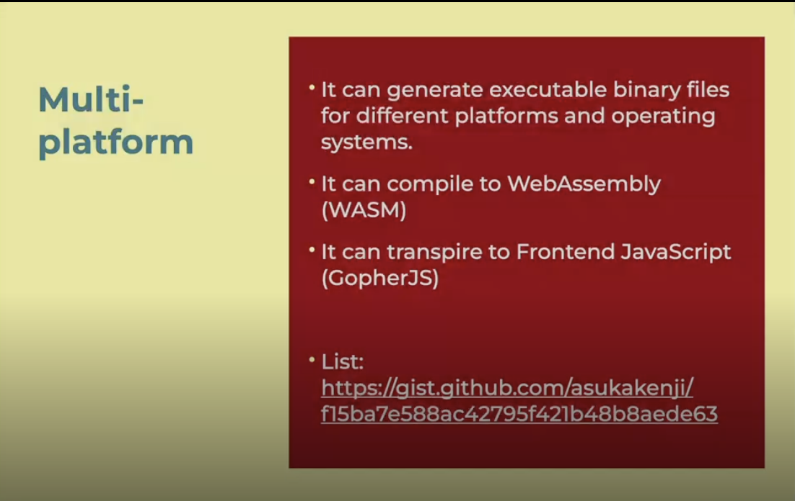

<details>
  <summary>Learn More..</summary>

  - *Executable binary files*
    - We can select different platforms and different operating systems
      - platform: this pertains to architecture of cpu (i.e, x86: intel based, arm: silicon based mac)
      - os: macos, linux, windows
      - when you build go projects by default it will create a binary for your architecture and os. You will have to choose the architecture and os binaries you want your application to run on by using the cli
  - *WASM*
    - Go can be compiled into webassembly
      - Webassembly: ability of web platform (browsers) to execute native code that can be written in different languages, in this case go
        - usecases: web based games, compression/decompression. cryptography, crypto currency, deep learning (AI models)
  - *Transpile to front end JS*
    - Transpilation: takes on source code and outputs a different source code
    - GopherJS: transpiles go to javascript
  - *[OS Compatibility](https://gist.github.com/asukakenji/f15ba7e588ac42795f421b48b8aede63)*
    - You can create a library of code that can be executed on a specific platform, but interacting with ios sdk to talk to the touch screen it will not be available from go, you can create a library than can transpile to some native code to accomplish some low level action (i.e go itself can not interact with macos but can be used to create libraries that transpile to native languages that can, c, c++)

</details>

### Common Use cases
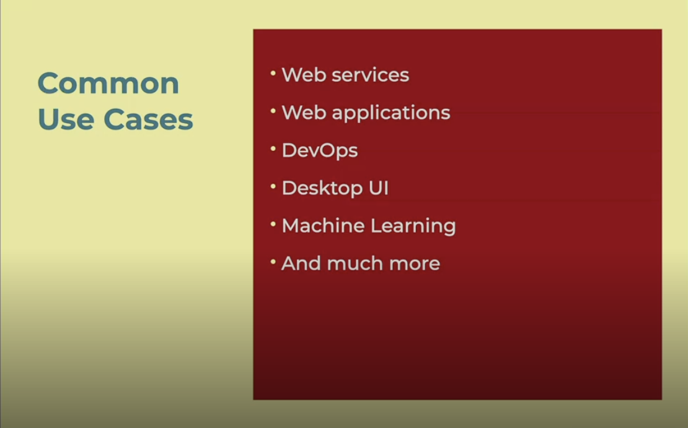
<details>
  <summary>Learn More...</summary>

  - *Web services*
    - restful services or micro services to provide services to a front end application.
  - *Web Apps*
    - can create web server directly in go
    - can create website using go, not as common
  - *Devops*
  - *Desktop UI*
    - Not as common
  - *Machine Learning*
    - can train models and execute, although python is more popular for ai right now it is slower and not actually as ideal as go at much larger scale
  - *And much more*
    - This directory/course focuses on the fundamentals that can be applied to any use case + web services & web applications

</details>
